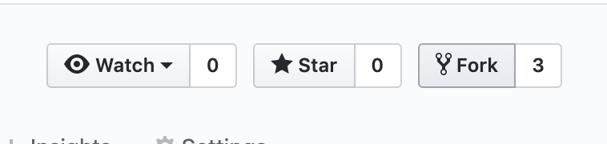
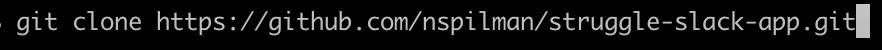

Welcome to the exciting world of open source development! This post will outline how to get the project code on your local computer, so you can start coding. 

## Contents

- [Forking a Repo](#forking-a-repo)
- [Pulling the Repo down to our local computer](#pulling-the-repo-down-to-our-local-computer)
- [Running your code locally](#running-your-code-locally)

## Forking a Repo
The first step is to go to the repo from which we're forking. On the top right above the code, we will see the option to fork. 

We are prompted to choose where to fork the repo. We'll choose our local. 

## Pulling the Repo Down to our Local Computer
Once the repo is forked onto our personal Github, let's go to the repo. From here, click the Clone Or Download button. 

Copy the web url that you're presented. 

In your terminal, navigate to the folder you want to pull the repo down to. 
Type `git clone`, paste the copied url and run the line. 

`cd` let's cd into our newly create repo!

## Running Your Code Locally
Now that you have the code locally, let's confirm you can run it! Some projects require additional setup, which will vary based on the tech (python and virtual environments, node and node_moduels, etc). 

In this example, our gatsby site runs on node.js, so we'll go to the repo and run `npm install` to pull down all the node packages listed in the `package.json` file. 

Once the packages pull down, We'll run `gatsby develop`, and the terminal tells us its running on our localhost. 

Success! Happy hacking.